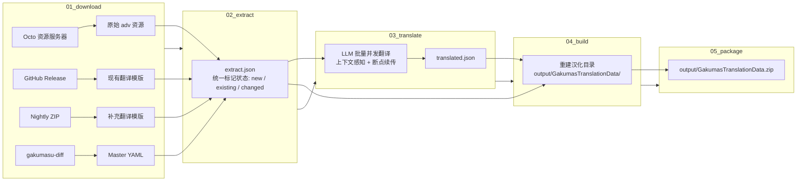

# gkm-tl

《学园偶像大师》(Gakuen iDOLM@STER / 学マス) 游戏文本自动化翻译与增量构建工具。

`gkm-tl` 是一套完整的端到端自动化汉化流水线：直接连接游戏资源服务器拉取最新日文资源，结合社区汉化模版与 Master 数据库进行精确的增量差分对比，调用 LLM 进行带有上下文感知和角色设定的自动化批量翻译，最终生成可直接用于汉化插件的资源包。

---

## ✨ 核心特性

- **自动化资源抓取** — 对接游戏官方 Octo 资源服务器，支持 Protobuf 数据库解析与 AES-CBC 解密，多线程高速下载最新的剧情脚本 (`adv_*.txt`)；自动同步上游最新 Release 模版与 Master 差分数据库。
- **高精度增量差分** — 覆盖 4 类游戏文本格式，通过多级 UID 与内容快照机制精准识别 `new`（新增）、`existing`（已翻译且未变更）和 `changed`（日文原文更新）条目，杜绝重复翻译与 Token 浪费。
- **多源汉化回退机制** — 优先使用上游 Release 翻译，缺失条目自动回退至 Nightly 补充模版，保证翻译覆盖率最大化。
- **多 LLM 后端与上下文感知** — 支持标准 **OpenAI 兼容 API** 与 **Anthropic Claude API**；根据剧情类别、角色、章节及卡面信息动态组装上下文 Prompt，内置 15 位偶像官方译名映射。
- **高并发与断点续传** — 支持配置批量大小（`batch_size`）与并发线程数（`max_concurrent`）；内置 Checkpoint 机制，翻译中断后可零成本无缝恢复。
- **零额外开销与无缝打包** — 若提取阶段检测到无新增待翻译文本，自动跳过后续阶段；构建阶段生成完全兼容 [chinosk6/GakumasTranslationData](https://github.com/chinosk6/GakumasTranslationData) 的标准目录结构与 ZIP 归档。
- **开箱即用的 CI/CD** — 内置 GitHub Actions Nightly 工作流，每日自动定时检查游戏更新、运行测试套件并自动构建与发布 Release。

---

## 🏗️ 架构与流水线

项目采用解耦的五阶段流水线设计，阶段间通过结构化缓存文件解耦：



### 流水线阶段详解

| 阶段 | 脚本 | 职责与核心逻辑 | 产物 / 缓存 |
| :--- | :--- | :--- | :--- |
| **Stage 1: 下载** | `stages/01_download.py` | 1. 请求 Octo API 并解密获取资源清单，多线程下载 `adv_*.txt`。<br/>2. 下载 GitHub Release 现有中文模版。<br/>3. 下载 gkm_tl nightly 补充模版（可通过配置关闭）。<br/>4. 下载并解压 `gakumasu-diff` master 数据。 | `cache/server/`<br/>`cache/mod/`<br/>`cache/nightly/`<br/>`cache/gkm-diff/` |
| **Stage 2: 提取** | `stages/02_extract.py` | 针对 4 种数据源进行提取与对比，建立唯一的条目 UID，标记 `new` / `existing` / `changed`：<br/>• **Resource**: 冒险脚本，提取 `message`/`narration`/`title`/`choicegroup`，支持 `<r\=JP>CN</r>` 语法。<br/>• **Master**: YAML 数据与快照比对，按记录顺序与 ID 双重匹配。<br/>• **Generic**: `genericTrans/**/*.json` 键值提取。<br/>• **Localization**: 递归提取 `localization.json` 并通过假名检测判定未翻译文本。 | `cache/extract.json` |
| **Stage 3: 翻译** | `stages/03_translate.py` | 1. 筛选待翻译文本（默认仅翻译 `new`，可配置开启 `changed` 翻译）。<br/>2. 根据剧情上下文对条目分组并构建 Prompt，注入角色中文名。<br/>3. 线程池并发调用 LLM 进行翻译，实时保存 Checkpoint。<br/>4. 若无待翻译条目，生成 `cache/nothing_to_translate` 标记并提前结束。 | `cache/translated.json`<br/>`cache/translate_checkpoint.json` |
| **Stage 4: 构建** | `stages/04_build.py` | 按照插件规范重构完整目录结构：<br/>• `resource/*.txt`：`message`/`narration`/`title` 替换为 `text=<r\=日文原文>中文翻译</r>`，`choicegroup` 直接替换为中文（与上游模版一致），角色名替换为中文。<br/>• `masterTrans/*.json`：合并翻译并更新 Master 源文本快照。<br/>• `genericTrans/*.json` 与 `localization.json`：写回翻译字段。<br/>• 写入 `version.txt` 构建版本号。 | `output/GakumasTranslationData/`<br/>`cache/master_source_snapshot.json` |
| **Stage 5: 打包** | `stages/05_package.py` | 将构建目录打包为 `GakumasTranslationData.zip`，显式包含 `local-files/` 目录项以确保汉化插件能正确识别。 | `output/GakumasTranslationData.zip` |

---

## 🚀 快速开始

### 1. 环境准备

- **Python** $\ge$ 3.11（推荐使用 **PyPy 3.11** 获得更快的解析与构建速度）
- **[uv](https://docs.astral.sh/uv/)**（现代高效的 Python 包与虚拟环境管理器）

### 2. 安装依赖

```bash
git clone https://github.com/huochai67/gkm_tl.git
cd gkm_tl

# 使用 uv 一键安装依赖并配置虚拟环境
uv sync
```

### 3. 配置

复制配置模版：

```bash
# Linux / macOS
cp config.yaml.example config.yaml

# Windows (PowerShell)
Copy-Item config.yaml.example config.yaml
```

编辑 `config.yaml`，填入你的 LLM 接口信息：

```yaml
llm:
  backend: openai # 支持 openai 或 anthropic
  base_url: "https://api.openai.com/v1"
  api_key: "sk-your-api-key"
  model: "gpt-4o-mini"
  max_tokens: 4096
  batch_size: 20
  max_concurrent: 5
  timeout: 180
  temperature: 0.2 # 低温确定性输出；不支持该参数的后端会自动忽略
  skip_changed: true # 设为 false 可重新翻译日文原文发生变更的条目
```

### 4. 运行完整流水线

```bash
uv run python run.py
```

执行完成后，可直接在 `output/` 目录下获取产物：
- 目录结构：`output/GakumasTranslationData/`
- 发布压缩包：`output/GakumasTranslationData.zip`

### 5. 单独运行指定阶段

在调试或开发过程中，你也可以分阶段单独执行：

```bash
uv run python stages/01_download.py   # 阶段 1: 资源与模版下载
uv run python stages/02_extract.py    # 阶段 2: 提取与增量对比
uv run python stages/03_translate.py  # 阶段 3: LLM 批量翻译
uv run python stages/04_build.py      # 阶段 4: 重构输出目录
uv run python stages/05_package.py    # 阶段 5: 打包生成 ZIP
```

---

## ⚙️ 配置与环境变量说明

### 配置文件结构 (`config.yaml`)

| 配置模块 | 字段 | 类型 | 说明 |
| :--- | :--- | :--- | :--- |
| **`llm`** | `backend` | string | LLM 后端类型：`openai`（默认）或 `anthropic` |
| | `base_url` | string | API 请求基础地址（例如 `https://api.openai.com/v1`） |
| | `api_key` | string | API 密钥 |
| | `model` | string | 调用的模型名称（例如 `gpt-4o-mini`, `claude-3-5-sonnet-20241022`） |
| | `max_tokens` | integer | 单次请求最大生成 Token 数（默认 `4096`） |
| | `batch_size` | integer | 单个 Prompt 包含的待翻译条目数量（默认 `20`） |
| | `max_concurrent` | integer | 翻译并发请求线程数（默认 `5`） |
| | `timeout` | integer | 请求超时时间（秒，默认 `180`） |
| | `temperature` | number | 采样温度（默认 `0.2`，低温提升批量输出稳定性） |
| | `skip_changed` | boolean | 是否跳过原文发生变更但已有旧翻译的条目（默认 `true`） |
| **`paths`** | `server_cache` | string | Octo 服务器原始资源下载目录（默认 `cache/server`） |
| | `mod_cache` | string | 上游 Release 翻译模版目录（默认 `cache/mod`） |
| | `nightly_mod_cache` | string | 补充 Nightly 翻译模版目录（默认 `cache/nightly`） |
| | `gkm_diff` | string | gakumasu-diff Master 数据目录（默认 `cache/gkm-diff`） |
| | `output` | string | 构建与打包产物输出目录（默认 `output`） |
| **`github`** | `owner` | string | 上游汉化仓库所有者（默认 `chinosk6`） |
| | `repo` | string | 上游汉化仓库名称（默认 `GakumasTranslationData`） |
| | `use_nightly` | boolean | 是否下载并使用 nightly 模版进行缺失补全（默认 `true`） |
| **`character_names`** | `[id]: [name]` | map | 角色简称到中文官方译名的映射表（用于 Prompt 提示与替换） |
| **`octo`** | *(见示例)* | map | 游戏客户端资源服务器接入参数（App ID、Secret、版本号、解密密钥等） |

### 环境变量对照

所有关键参数均支持通过环境变量直接覆盖（环境变量优先级高于 `config.yaml`），方便在 CI/CD 中通过 Secrets 注入：

| 环境变量 | 覆盖配置项 | 说明 |
| :--- | :--- | :--- |
| `LLM_BACKEND` | `llm.backend` | LLM 后端 (`openai` / `anthropic`) |
| `LLM_BASE_URL` | `llm.base_url` | API Base URL |
| `LLM_API_KEY` | `llm.api_key` | API Key |
| `LLM_MODEL` | `llm.model` | 模型名称 |
| `LLM_MAX_TOKENS` | `llm.max_tokens` | 单次最大 Token 数 |
| `LLM_BATCH_SIZE` | `llm.batch_size` | 批处理条目数 |
| `LLM_MAX_CONCURRENT` | `llm.max_concurrent`| 并发请求数 |
| `LLM_TIMEOUT` | `llm.timeout` | 请求超时（秒） |
| `LLM_TEMPERATURE` | `llm.temperature` | 采样温度（浮点数） |
| `LLM_SKIP_CHANGED` | `llm.skip_changed` | 是否跳过 `changed` 条目（`1/0`、`true/false` 等） |
| `BUILD_VERSION` | `version.txt` | 构建版本号（默认自动生成为 `auto-YYYY-MM-DD`） |

---

## 🛠️ 辅助工具

### 导出待翻译 / 变更条目 (`export_pending.py`)

在执行 `stages/02_extract.py` 后，如果需要人工审查新增或变更的文本，可以使用内置导出脚本：

```bash
# 默认导出 new.json 和 changed.json 到 cache/ 目录
uv run tools/export_pending.py

# 仅导出新增条目
uv run tools/export_pending.py --status new

# 仅导出原文变更条目
uv run tools/export_pending.py --status changed
```

导出的 JSON 文件保存在 `cache/new.json` 或 `cache/changed.json`，格式清晰易读，方便用于人工校对、统计或自建翻译数据集。

---

## 📂 项目结构

```
gkm-tl/
├── config.yaml.example        # 配置文件模版
├── pyproject.toml             # Python 项目元数据与依赖定义
├── run.py                     # 流水线统一调度入口
│
├── stages/                    # 流水线阶段实现
│   ├── 01_download.py         # Stage 1: 资源与模版下载
│   ├── 02_extract.py          # Stage 2: 提取与增量对比
│   ├── 03_translate.py        # Stage 3: LLM 批量并发翻译
│   ├── 04_build.py            # Stage 4: 汉化包目录构建
│   └── 05_package.py          # Stage 5: ZIP 压缩打包
│
├── lib/                       # 核心业务与解析库
│   ├── config.py              # 配置加载与路径解析
│   ├── llm_backend.py         # LLM 后端封装 (OpenAI / Anthropic)
│   ├── octo.py                # Octo 客户端与资源解密
│   ├── text_utils.py          # 日文字符与假名识别工具
│   ├── parser_resource.py     # 冒险剧情脚本解析器
│   ├── parser_master.py       # Master YAML 解析与快照比对
│   ├── parser_generic.py      # Generic JSON 翻译解析器
│   ├── parser_localization.py # Localization UI 文本解析器
│   └── proto/                 # Protobuf 定义及生成文件
│       └── octodb_pb2.py
│
├── tools/                     # 辅助工具集
│   └── export_pending.py      # 提取条目导出工具
│
├── tests/                     # 自动化测试套件
│   └── test_regressions.py    # 回归与单元测试
│
├── .github/workflows/         # CI/CD 工作流
│   └── nightly.yml            # 每日自动构建与发布流水线
│
├── cache/                     # 运行时缓存（自动生成，受 .gitignore 保护）
└── output/                    # 最终产物输出（自动生成）
    ├── GakumasTranslationData/ # 解压状态的汉化包目录
    └── GakumasTranslationData.zip # 可直接安装使用的压缩包
```

---

## 🧪 测试与开发

项目包含覆盖下载、解析、比对、翻译控制、构建与打包各模块的回归测试套件。

运行测试：

```bash
uv run python -m unittest discover -s tests
```

---

## 🔄 CI / CD 自动化 (Nightly Build)

本项目通过 GitHub Actions (`.github/workflows/nightly.yml`) 实现了全自动的日常构建：

1. **定时触发**：每天北京时间 05:00（UTC 21:00）自动运行。
2. **自动化测试**：执行完整的单元与回归测试套件。
3. **增量构建**：拉取当天游戏最新资源，差分比对并调用 LLM 翻译。
4. **按需发布**：若存在新翻译内容，自动更新并发布至项目的 `nightly` Release，附带版本号、Octo Revision 以及 SHA-256 校验和。

---

## 🙏 致谢与参考

- [chinosk6/GakumasTranslationData](https://github.com/chinosk6/GakumasTranslationData) — 社区优秀的《学园偶像大师》汉化数据仓库与规范参考。
- [gakumasu-diff](https://github.com/imas-tools/gakumasu-diff) — 及时更新的学园偶像大师 Master 数据差分仓库。
- [GakumasLocalify](https://github.com/chinosk6/GakumasLocalify) — 学园偶像大师本地化补丁插件。
- 感谢所有为《学园偶像大师》社区汉化与工具生态做出贡献的开发者与译者！
